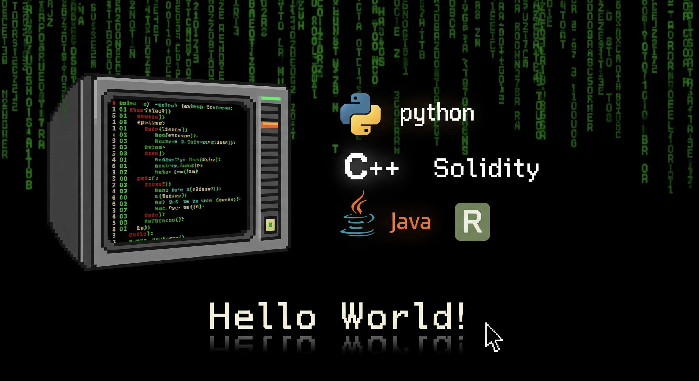

# 👋 Hi, I’m Seraphim Ruben Udjung
**Computer Science Undergraduate | AI & Quant Finance | Full-Stack Developer**

Welcome to my digital workspace! I am a software engineer and AI researcher focused on bridging the gap between deep machine learning, financial technology, and robust web applications. I thrive at the intersection of data-driven market analysis and scalable software architecture.

---

## 🌍 About Me
- 🎓 **Academics:** Computer Science Global Class undergraduate at **BINUS University** (Alam Sutera) & studied abroad at the **JW Kim College of Future Studies (Woosong University)** in South Korea for my sixth semester.
- 💼 **Experience:** Incoming Technical Intern at **PT Bank Central Asia Tbk (BCA)**, combining traditional enterprise banking environments with modern tech solutions.
- 📈 **Market Focus:** Passionate about international finance, stock forecasting, and automated investment strategies, particularly analyzing the IDX 30 and currency exchange fluctuations.

---

## 🛠 Tech Stack & Tools

**Languages & Frameworks:**  
 

 
 

**Data Science & AI:**  

**Design, Deployment & Tools:**  
 
 

---

## 📌 Featured Work & Research

### 🔬 AI & Quantitative Modeling
*   **Time Series Financial Research** – Authored *"From LSTM to NeuralProphet: Advancing Stock Price Forecasting with Modern Time Series Models"*, analyzing the IDX 30 index.
*   **[Axiom](https://github.com/daemon-10k/Axiom)** – AI-Powered Indonesian Stock Predictor.
*   **[CulinAIre](https://github.com/daemon-10k/CulinAIre)** – Intelligent, ingredient-based recipe recommendation engine.
*   **NLP Research** – Developing English haiku assistants and financial application models leveraging BERT architectures.

### 💻 Full-Stack Architecture
*   **EventFund** – Modern, interactive web application built strictly with **React.js and .jsx**.
*   **[MemorEase](https://github.com/daemon-10k/SRS_Flashcard)** – Spaced Repetition Flashcard App designed for cognitive optimization.

### 🚀 Leadership & Entrepreneurship
*   **BPreneur Platform** – Spearheaded digital transformation by launching the official organization website using WordPress and Hostinger.
*   **Heart from Heroes** – Lead Coordinator for a major social action event and seminar at BINUS Alam Sutera, managing rundowns, speakers, and volunteer teams.
*   **Beelivery** – Founding member/leader for an innovative student entrepreneurship project.

---

## ⚡ Beyond the Code
When I am not training models or building full-stack applications, you can find me:
*   ⚽ Analyzing European football statistics (always keeping an eye on Manchester City).
*   ✈️ Exploring global tech hubs and regional cultures across Seoul, Busan, Abu Dhabi, Dubai, and Jakarta.
*   💻 Tracking the latest developments in high-performance hardware architecture. 

---

## 📊 GitHub Analytics

  
  

 

  

---

## 🌐 Let's Connect
 

---
