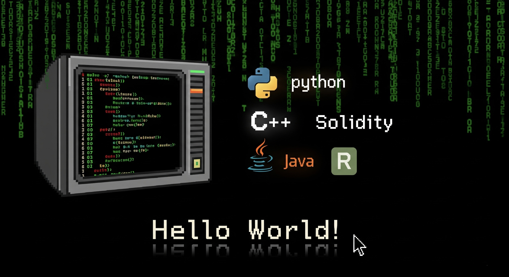

# 👋 Hi, I’m Ruben  
💻 Computer Science undergrad | AI, FinTech & Web Development  
🚀 Building **AI-driven apps** & **full-stack projects**  
📊 Passionate about **machine learning**, **UI/UX**, and **scalable solutions**

---

## 🚀 About Me  
- 🎓 Studying **Computer Science**  
- 💡 Interested in **AI/ML, Quant, Blockchain, and FinTech**    
- 🎯 Goal: Build tech solutions & scale them into impactful businesses  

---

## 🛠 Skills  
  
  
  
  
  
  

---

## 📌 Featured Projects  
- [MemorEase](https://github.com/daemon-10k/SRS_Flashcard) – Spaced Repetition Flashcard App 
- [Axiom](https://github.com/daemon-10k/Axiom) – AI-Powered Indonesian Stock Predictor 
- [Recipe Recommender](https://github.com/daemon-10k/CulinAIre) – Ingredient-based recipe suggestion system  

---

## 📊 GitHub Stats  
  
  

---

## 🌐 Connect with Me  
  

---
